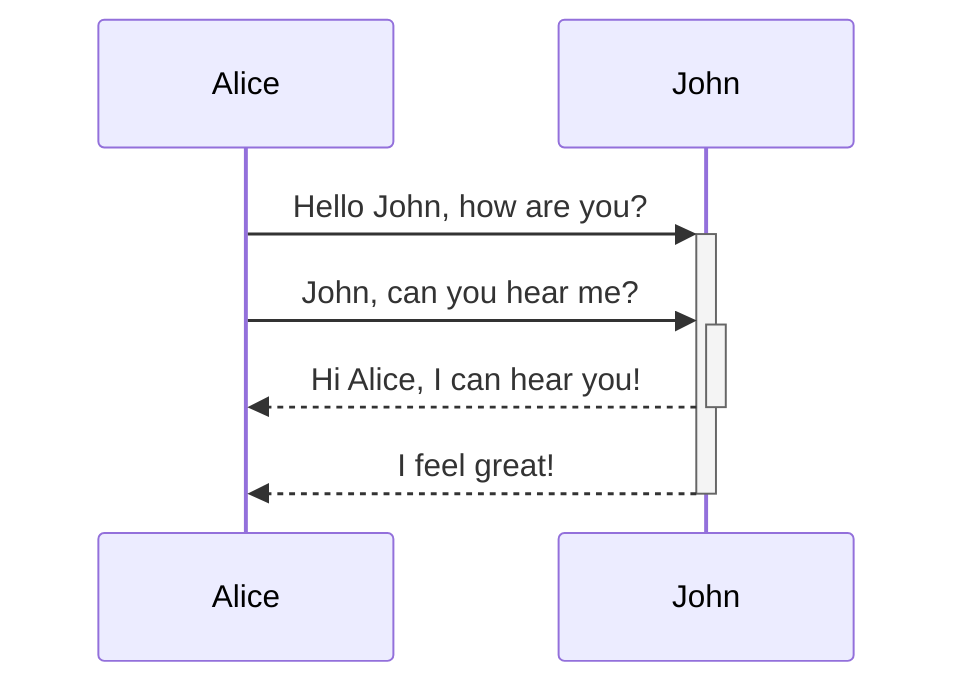

---
tags:
  - "#markdown"
---


```
# Header 1
## Header 2
### Header 3
#### Header 4
##### Header 5
###### Header 6
```
# Header 1
## Header 2
### Header 3
#### Header 4
##### Header 5
###### Header 6

Tag `#tag`

```
_italics_
*italics*

__bold__
**bold**

~~strikethrough~~
==highlight==
```
_italics_
*italics*

__bold__
**bold**

~~Strikethrough~~
==Highlight==


#### Lists ^6b57f1

	- , * , +

- a
- b
- c

	Number Lists  --> 1.

1. a
2. b
3. c

	Check List --> - [ ] / Ctrl + Enter

- [x] a
- [ ] b
- [ ] c

#### Back link notes

`[[My First Note]]`
[[My First Note]]

	Alias

`[[My First Note | Note]]`
[[My First Note| Note]]

	Headers in same page

`[[Markdown Learning#Header 4 | Header 4]]`
[[Markdown Learning#Header 4 | Header 4]]

	Headers in diffrent page

`[[My Frist note#start | start]]`
[[My First Note#start| start]]

	Blocks in same page

`[[Markdown Learning#^6b57f1 | Lists]]`
[[Markdown Learning#^6b57f1 | Lists]]

	Blocks in diffrent page
`[[My Frist note#^1308a2 | Start block]]`
[[My First Note#^1308a2| Start block]]


#### Link Text

`[Google](https://www.google.co.in/)`
[Google](https://www.google.co.in/)

##### Embedding Links
"!" before link

![[My First Note#start| start]]

#### Footnotes IDK NOT WORKING

This is footnote 1 [^1]

[^1]: This is definition

#### Comments

This is an %%inline%% comment.

%%
This is a block comment.

Block comments can span multiple lines.
%%

#### Escaping Markdown Syntax
- Asterisk: `\*`
- Underscore: `\_`
- Hashtag: `\#`
- Backtick: `` \` ``
- Pipe (used in tables): `\|`
- Tilde: `\~`


#### Tables
You can create tables using vertical bars (`|`) to separate columns and hyphens (`-`) to define headers. Here's an example:

```
| First name | Last name |
| ---------- | --------- |
| Max        | Planck    |
| Marie      | Curie     |
```

| First name | Last name |
| ---------- | --------- |
| Max        | Planck    |
| Marie      | Curie     |


#### Diagram





#### Math

```
$$
\begin{vmatrix}a & b\\
c & d
\end{vmatrix}=ad-bc
$$
```

$$
\begin{vmatrix}a & b\\
c & d
\end{vmatrix}=ad-bc
$$

`$e^{2i\pi} = 1$`
This is an inline math expression $e^{2i\pi} = 1$.

#### Code
```js
function fancyAlert(arg) {
  if(arg) {
    $.facebox({div:'#foo'})
  }
}
```

#### Quotes
```
> This is quote
> > This is nested quote
```

> This is quote
> > This is nested quote


#### Callouts

> [!tip]- Tips

> [!faq]- Are callouts foldable?
> Yes! In a foldable callout, the contents are hidden when the callout is collapsed.

> [!abstract]- Abstract


[Obsidian website for callouts](https://help.obsidian.md/callouts)